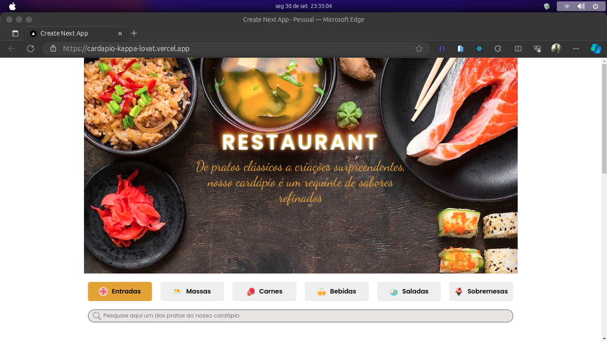

# CARDAPIO RESTAURANT

A proposta desse projeto é criar um cardapio de restaurante em React, para colocar em prática os conceitos do conhecimento adquirido até aqui.

### Acesse o Link: https://cardapio-kappa-lovat.vercel.app/

  

## Sobre:

Ao desenvolver a aplicação foi possível aplicar os seguintes conhecimentos obtidos na trilha de React.js:

 - Utilizar o método Array.map para exibir componentes com base em uma coleção de dados;
 - Utilizar o método Array.filter para realizar buscas em uma coleção de dados;
 - Utilizar o evento Onchange para criar a funcionalidade que permite o usuário buscar um produto ao digitar o seu nome em um campo de busca;
 - Criar códigos e funções JavaScript;
 - Disponibilizar o link de acesso do site por meio de um CR Code.

## Demonstração

https://github.com/user-attachments/assets/96407437-4e56-486b-8b97-b3da9895732d
